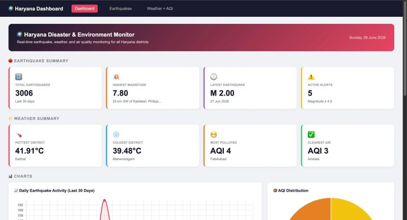
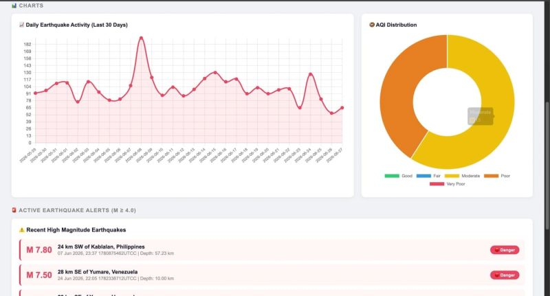
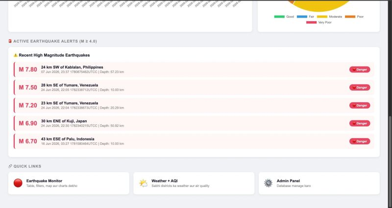
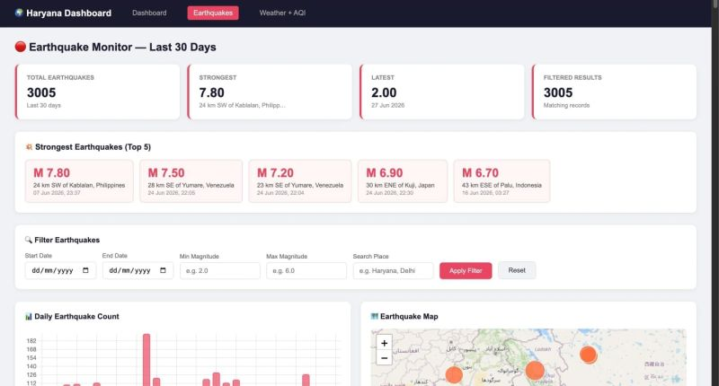
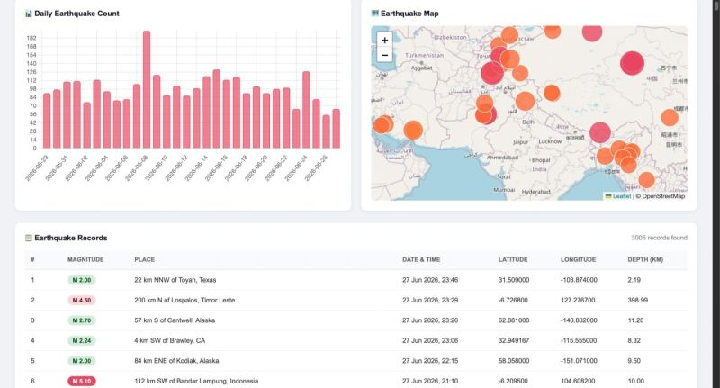

# 🌍 Haryana Disaster & Environment Monitoring Dashboard

A real-time disaster and environment monitoring dashboard for all 22 districts of Haryana. Built with Django & MySQL, it tracks earthquakes, weather conditions, and air quality index (AQI) using live APIs.

---

## 🚀 Features

- 🔴 **Earthquake Monitor** — Live data from USGS API (last 30 days)
- 🌤️ **Weather Tracking** — Temperature, humidity, wind speed for all 22 districts
- 😷 **AQI Monitoring** — PM2.5, PM10, NO2, CO, Ozone levels
- 📊 **Charts** — Daily earthquake activity, temperature & AQI comparison
- 🗺️ **Earthquake Map** — Interactive Leaflet.js map with magnitude markers
- ⚠️ **Active Alerts** — High magnitude earthquake alerts (M ≥ 4.0)
- 📋 **District Table** — Combined weather + AQI data for all districts

---

## 🛠️ Tech Stack

| Layer | Technology |
|-------|-----------|
| Backend | Django (Python) |
| Database | MySQL |
| Frontend | HTML, CSS, JavaScript |
| Charts | Chart.js |
| Map | Leaflet.js |
| Earthquake API | USGS Earthquake API (Free) |
| Weather API | OpenWeather Current Weather API |
| AQI API | OpenWeather Air Pollution API |

---

## 📁 Project Structure
haryana_dashboard/

├── manage.py

├── requirements.txt

├── .env.example

├── haryana_dashboard/

│   ├── settings.py

│   ├── urls.py

│   └── wsgi.py

├── dashboard/

│   ├── models.py

│   ├── views.py

│   ├── urls.py

│   ├── admin.py

│   └── templates/

│       ├── index.html

│       ├── earthquakes.html

│       └── weather_aqi.html

└── scripts/

├── fetch_earthquakes.py

├── fetch_weather.py

└── fetch_aqi.py

---

## 📸 Screenshots

### Dashboard



### Dashboard Overview



### Dashboard Analytics



### Earthquake Monitoring



### Earthquake Details



---

## ⚙️ Setup & Installation

### 1. Clone the repository
```bash
git clone https://github.com/irshadaliks786-arch/haryana-dashboard.git
cd haryana-dashboard
```

### 2. Install dependencies
```bash
pip install -r requirements.txt
```

### 3. Create .env file
```bash
cp .env.example .env
```
Fill in your values:
SECRET_KEY=your_django_secret_key

OPENWEATHER_API_KEY=your_openweather_api_key

DB_NAME=haryana_dashboard

DB_USER=root

DB_PASSWORD=your_mysql_password

DB_HOST=localhost

DB_PORT=3306

### 4. MySQL Database setup
```sql
CREATE DATABASE haryana_dashboard;
```
Then run the SQL from `schema.sql` to create tables and insert district data.

### 5. Run migrations
```bash
python manage.py migrate
```

### 6. Fetch live data
```bash
python scripts/fetch_earthquakes.py
python scripts/fetch_weather.py
python scripts/fetch_aqi.py
```

### 7. Start server
```bash
python manage.py runserver
```

---

## 🌐 Pages

| Page | URL | Description |
|------|-----|-------------|
| Dashboard | `/` | Summary cards, alerts, charts |
| Earthquakes | `/earthquakes/` | Table, filters, map, chart |
| Weather + AQI | `/weather/` | District wise weather & AQI |
| Admin | `/admin/` | Django admin panel |

---

## 🔑 API Keys

| API | Cost | Link |
|-----|------|------|
| USGS Earthquake | Free (no key needed) | [earthquake.usgs.gov](https://earthquake.usgs.gov/fdsnws/event/1/) |
| OpenWeather | Free tier | [openweathermap.org](https://openweathermap.org/api) |

---

## 📊 Database Tables

- `districts` — 22 Haryana districts with coordinates
- `earthquakes` — Earthquake records from USGS
- `weather_data` — Weather records per district
- `air_quality_data` — AQI records per district

---

## 👨‍💻 Author

**Irshadali**
- GitHub: [@Irshadali1786](https://github.com/irshadali1786)

---

## 📄 License

This project is open source and available under the [MIT License](LICENSE).
